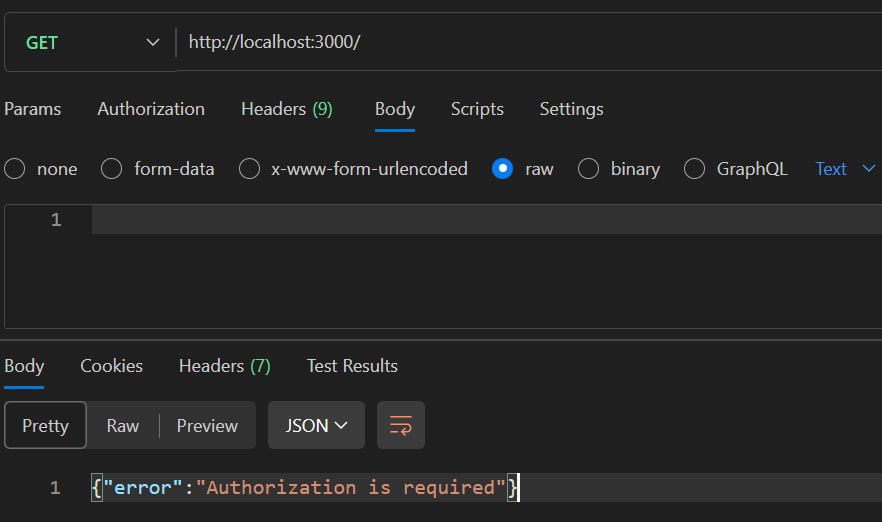
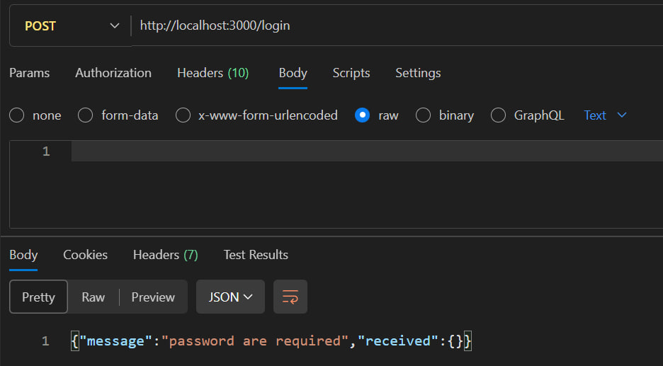
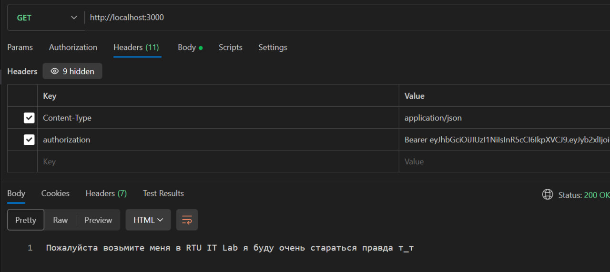
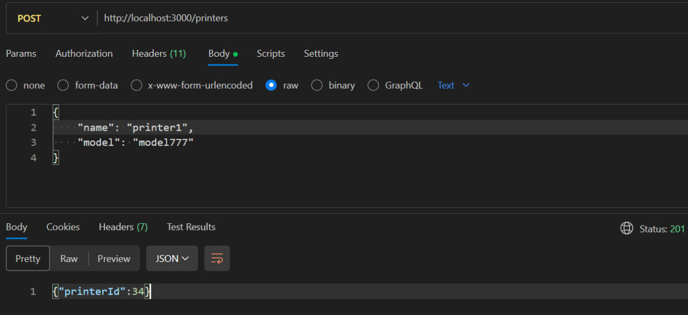
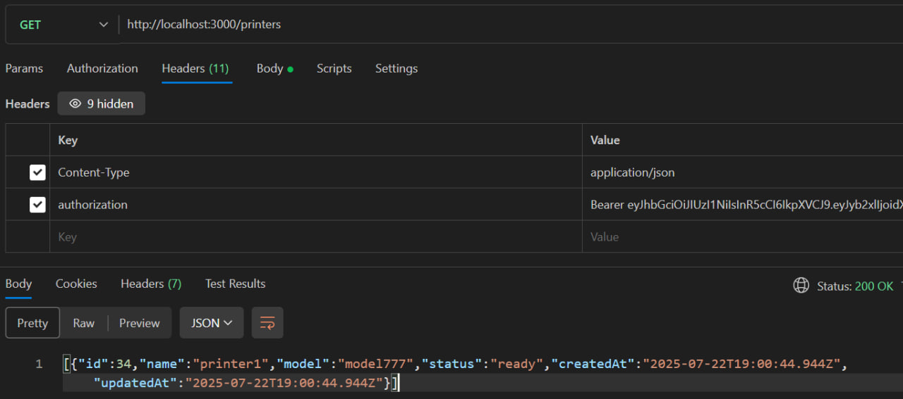
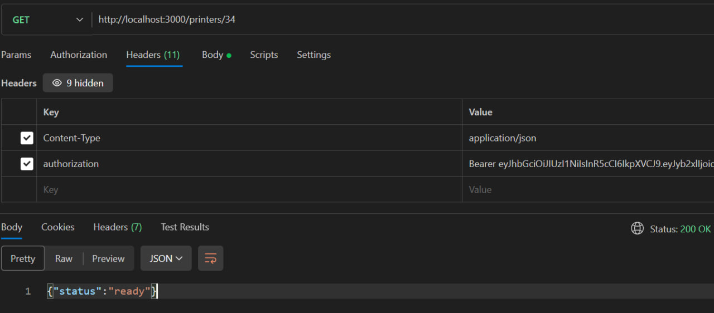
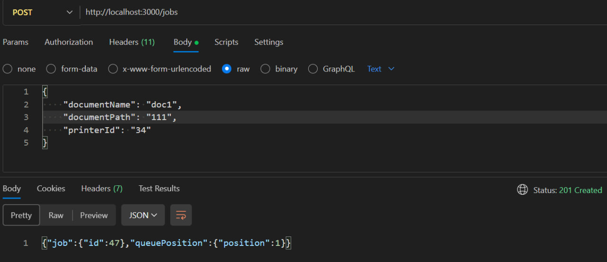
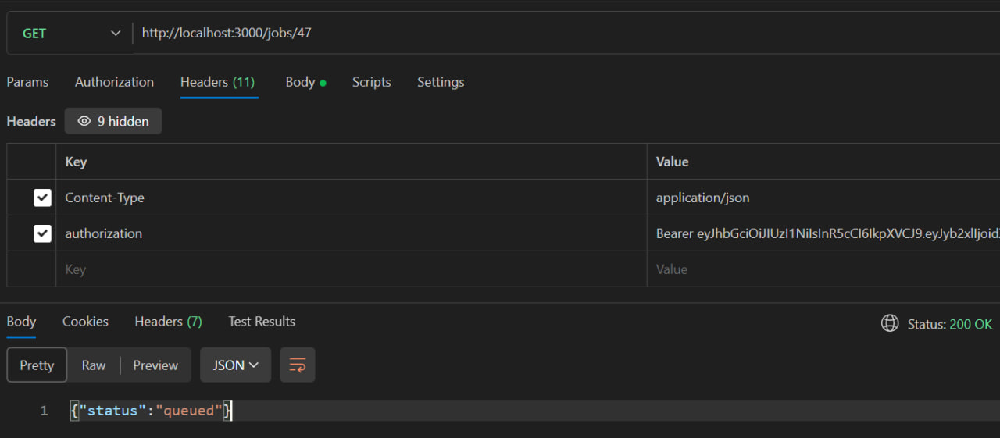
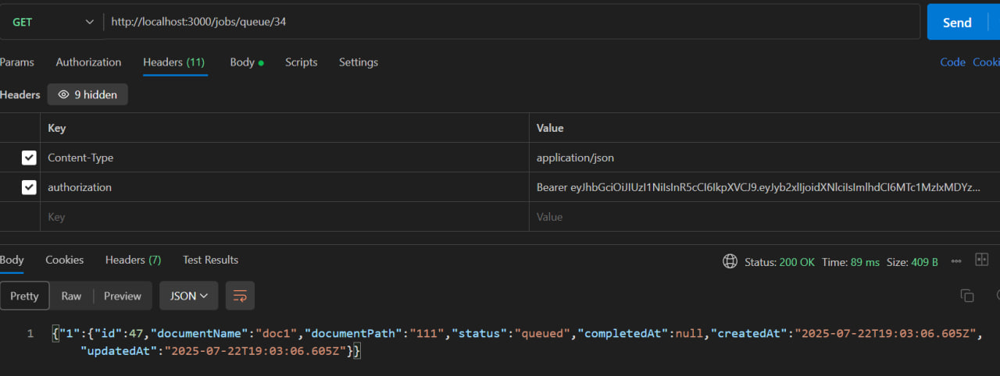

# 📇 PrintersQueue

Backend-сервис для управления очередями печати документов

📌 Принимает задания на печать от сотрудников
    
📌 Управляет очередями печати для каждого принтера
    
📌 Предоставляет статусы выполнения через HTTP API

# 📍 Копирование репозитория

```bash
git init
git clone https://github.com/OgurecRoman/PrintersQueue.git
```

# 🧲 Установка зависимостей

```bash
npm install
```

# 📎 Подготовка переменных окружения

копирование файла с примером в нужный

```bash
cp .testenv .env # для linux
```

```bash
copy .testenv .env # для windows
```

Поменяйте значения переменных окружения при необходимости (пароли, настройка базы данных)

# Запуск тестов

```bash
npm test
```

# Запуск сервера

```bash
npm start
```

# Примеры запросов в Postman











